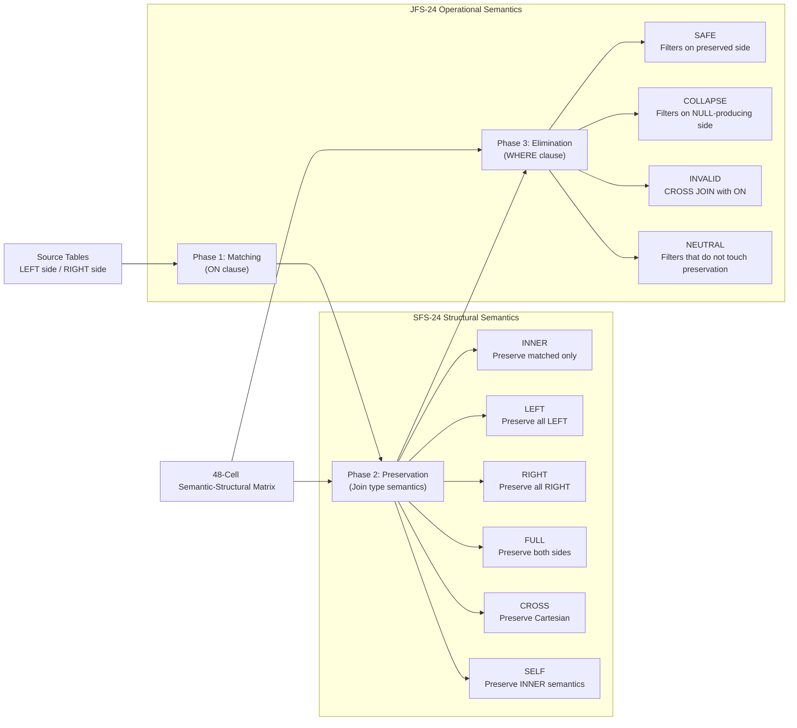

```mermaid
flowchart LR

    A["Source Tables\nLEFT side / RIGHT side"] --> B["Phase 1: Matching\n(ON clause)"]
    B --> C["Phase 2: Preservation\n(Join type semantics)"]

    C --> C1["INNER\nPreserve matched only"]
    C --> C2["LEFT\nPreserve all LEFT"]
    C --> C3["RIGHT\nPreserve all RIGHT"]
    C --> C4["FULL\nPreserve both sides"]
    C --> C5["CROSS\nPreserve Cartesian"]
    C --> C6["SELF\nPreserve INNER semantics"]

    C --> D["Phase 3: Elimination\n(WHERE clause)"]

    D --> E1["SAFE\nFilters on preserved side"]
    D --> E2["COLLAPSE\nFilters on NULL‑producing side"]
    D --> E3["INVALID\nCROSS JOIN with ON"]
    D --> E4["NEUTRAL\nFilters that do not touch preservation"]

    subgraph SFS24["SFS‑24 Structural Semantics"]
        C
        C1
        C2
        C3
        C4
        C5
        C6
    end

    subgraph JFS24["JFS‑24 Operational Semantics"]
        B
        D
        E1
        E2
        E3
        E4
    end

    F["48‑Cell Semantic‑Structural Matrix"] --> C
    F --> D
```
