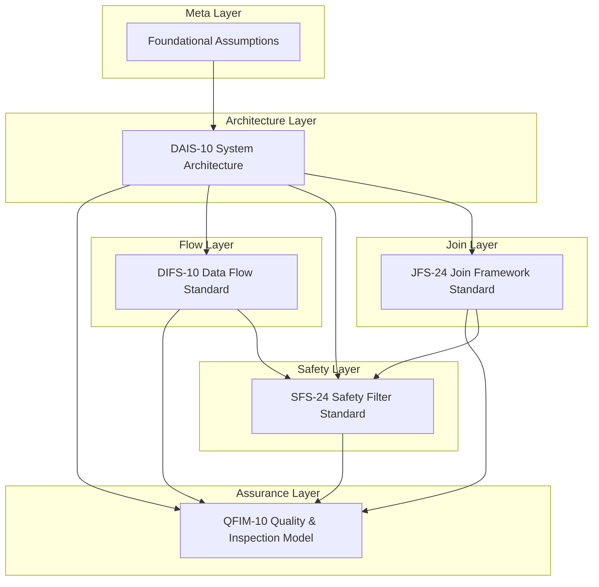

```mermaid
flowchart TB

    subgraph Meta_Layer [Meta Layer]
        FA[Foundational Assumptions]
    end

    subgraph Architecture_Layer [Architecture Layer]
        DAIS[DAIS-10 System Architecture]
    end

    subgraph Assurance_Layer [Assurance Layer]
        QFIM[QFIM-10 Quality & Inspection Model]
    end

    subgraph Flow_Layer [Flow Layer]
        DIFS[DIFS-10 Data Flow Standard]
    end

    subgraph Safety_Layer [Safety Layer]
        SFS[SFS-24 Safety Filter Standard]
    end

    subgraph Join_Layer [Join Layer]
        JFS[JFS-24 Join Framework Standard]
    end

    %% Relationships
    FA --> DAIS
    DAIS --> QFIM
    DAIS --> DIFS
    DAIS --> SFS
    DAIS --> JFS

    DIFS --> QFIM
    DIFS --> SFS

    JFS --> QFIM
    JFS --> SFS

    SFS --> QFIM

```
