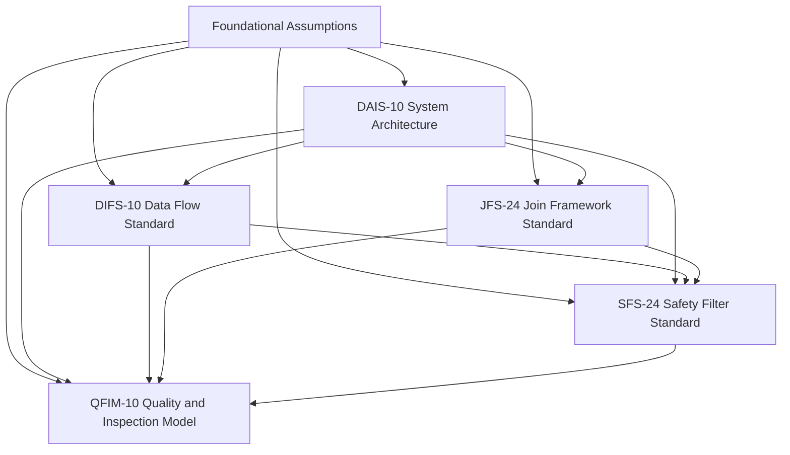

```mermaid
flowchart TD

    %% Meta Layer
    FA[Foundational Assumptions]

    %% Architecture Layer
    DAIS[DAIS-10 System Architecture]

    %% Assurance Layer
    QFIM[QFIM-10 Quality and Inspection Model]

    %% Flow Layer
    DIFS[DIFS-10 Data Flow Standard]

    %% Safety Layer
    SFS[SFS-24 Safety Filter Standard]

    %% Join Layer
    JFS[JFS-24 Join Framework Standard]

    %% Relationships
    FA --> DAIS
    FA --> QFIM
    FA --> DIFS
    FA --> SFS
    FA --> JFS

    DAIS --> QFIM
    DAIS --> DIFS
    DAIS --> SFS
    DAIS --> JFS

    DIFS --> QFIM
    DIFS --> SFS

    JFS --> QFIM
    JFS --> SFS

    SFS --> QFIM
```
